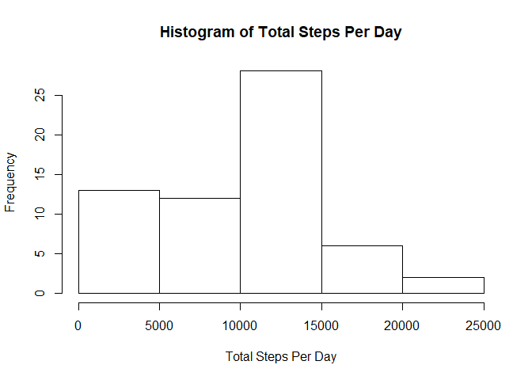
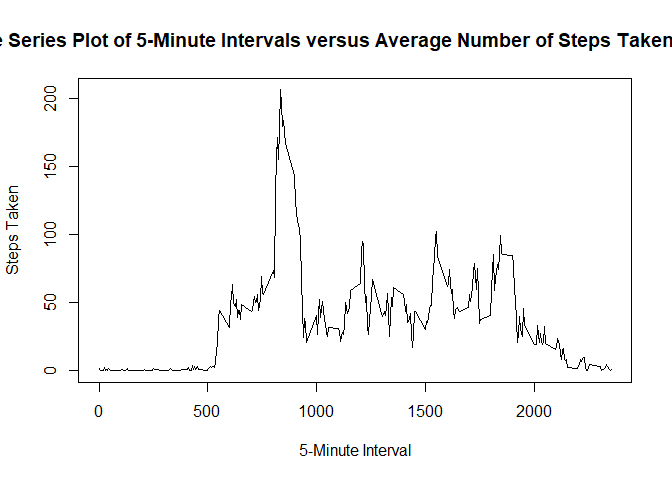
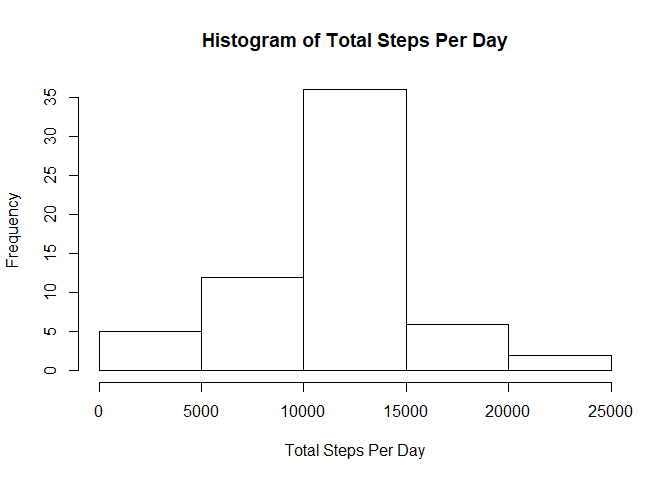
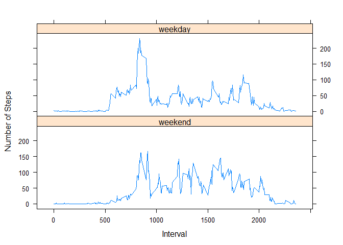

# Reproducible Research: Peer Assessment 1


## Loading and preprocessing the data

Load data and convert the values under date column to date format.


```r
library(dplyr)
```

```
## 
## Attaching package: 'dplyr'
```

```
## The following objects are masked from 'package:stats':
## 
##     filter, lag
```

```
## The following objects are masked from 'package:base':
## 
##     intersect, setdiff, setequal, union
```

```r
data1 <- read.csv("activity.csv", header = TRUE, comment.char= "")
data1$steps <- as.numeric(data1$steps)
```


## What is mean total number of steps taken per day?

Plot histogram of the total number of steps taken each day


```r
q1 <- data1 %>% group_by(date) %>% summarise(total = sum(steps, na.rm = TRUE))
hist(q1$total, main = "Histogram of Total Steps Per Day", xlab = "Total Steps Per Day")
```

<!-- -->

Compute mean and median steps per day.


```r
mean(q1$total)
```

```
## [1] 9354.23
```

```r
median(q1$total)
```

```
## [1] 10395
```

The mean is 9354 steps, while the median is 10395 steps.

## What is the average daily activity pattern?

Make a time series plot (i.e. type = "l") of the 5-minute interval (x-axis) and the average number of steps taken, averaged across all days (y-axis)


```r
q2 <- data1 %>% group_by(interval) %>% summarise(average = mean(steps, na.rm = TRUE))
plot(x = q2$interval, y = q2$average, type = "l", main = "Time Series Plot of 5-Minute Intervals versus Average Number of Steps Taken Per Day", xlab = "5-Minute Interval", ylab = "Steps Taken")
```

<!-- -->

Determine which 5-minute interval, on average across all the days in the dataset, contains the maximum number of steps.


```r
q2[which(q2$average == max(q2$average)), ]
```

```
## # A tibble: 1 × 2
##   interval  average
##      <int>    <dbl>
## 1      835 206.1698
```

The 5-minute interval starting from 0835H contains the maximum number of steps.

## Imputing missing values

Calculate and report the total number of missing values in the dataset.


```r
sum(is.na(data1$steps) == TRUE)
```

```
## [1] 2304
```

There are 2304 missing values in the dataset. 

Next, create new dataset data2 that is equal to original dataset but with missing data filled in. Where data is missing, we will use the mean for that interval as computed earlier. 


```r
data2 <- data1
data2$steps[is.na(data2$steps == TRUE)] <- q2$average[match (q2$interval, data2$interval)]
```

Make a histogram of the total number of steps taken each day.


```r
q3 <- data2 %>% group_by(date) %>% summarise(total = sum(steps, na.rm = TRUE))
hist(q3$total, main = "Histogram of Total Steps Per Day", xlab = "Total Steps Per Day")
```

<!-- -->

Compute mean and median steps per day.


```r
mean(q3$total)
```

```
## [1] 10766.19
```

```r
median(q3$total)
```

```
## [1] 10766.19
```

The new mean and median computed after filling in the missing data are both at 10766 steps per day, which are higher than both the original mean and median computed. 

## Are there differences in activity patterns between weekdays and weekends?

Create a new factor variable in the dataset with two levels -- "weekday" and "weekend" indicating whether a given date is a weekday or weekend day.


```r
data3 <- data2
data3$date <- as.Date(data3$date, "%Y-%m-%d")
weekdayslist <- c('Monday', 'Tuesday', 'Wednesday', 'Thursday', 'Friday')
data3$day <- factor((weekdays(data3$date) %in% weekdayslist),          levels=c(FALSE, TRUE), labels=c('weekend', 'weekday'))
```

Make a panel plot containing a time series plot (i.e. type = "l") of the 5-minute interval (x-axis) and the average number of steps taken, averaged across all weekday days or weekend days (y-axis).


```r
q4 <- data3 %>% group_by(day, interval) %>% summarise(average = mean(steps, na.rm = TRUE))
library(lattice)
xyplot(average~ interval | day, data = q4, layout = c(1,2), ylab = "Number of Steps", xlab = "Interval", type = "l")
```

<!-- -->

From the panel plot, there are some differences between observed activity between weekdays and weekends. For instance, there is considerably more activity for weekdays between 6am to 8am, and more activity for weekends during the evening.  
